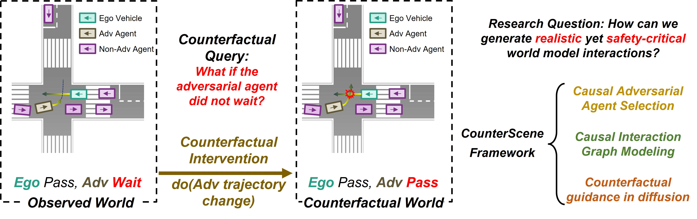
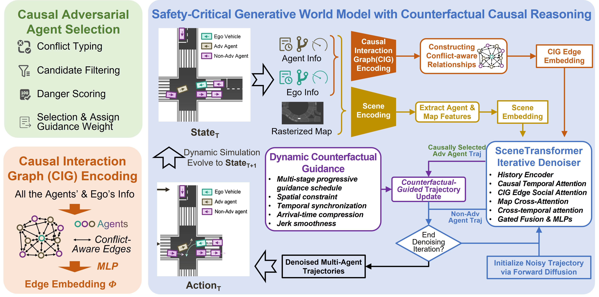
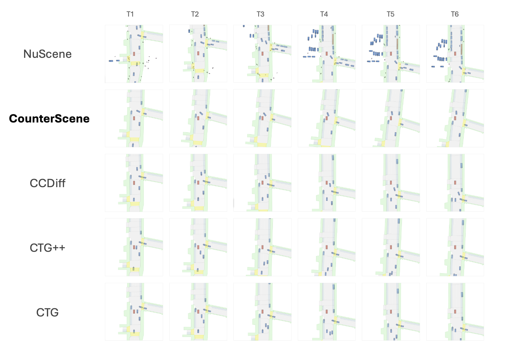
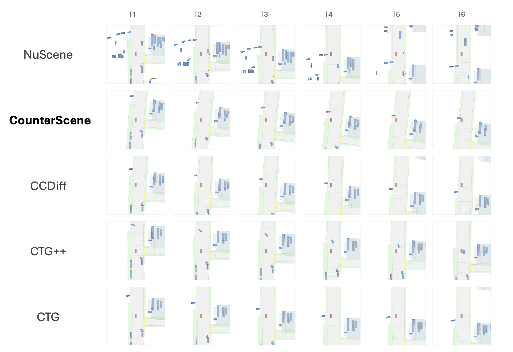
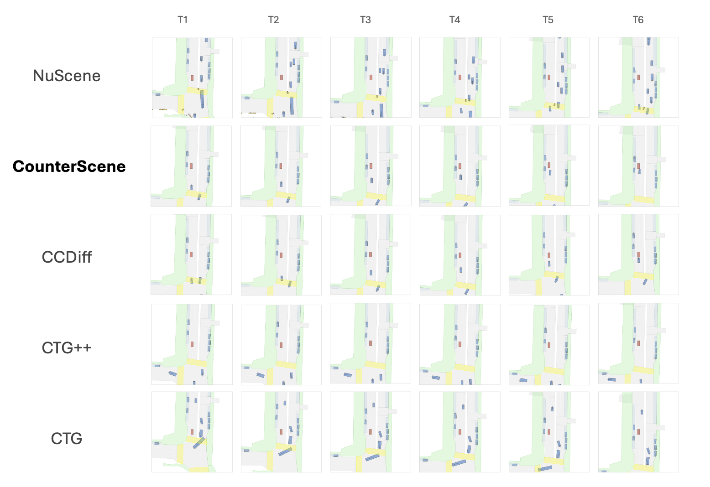
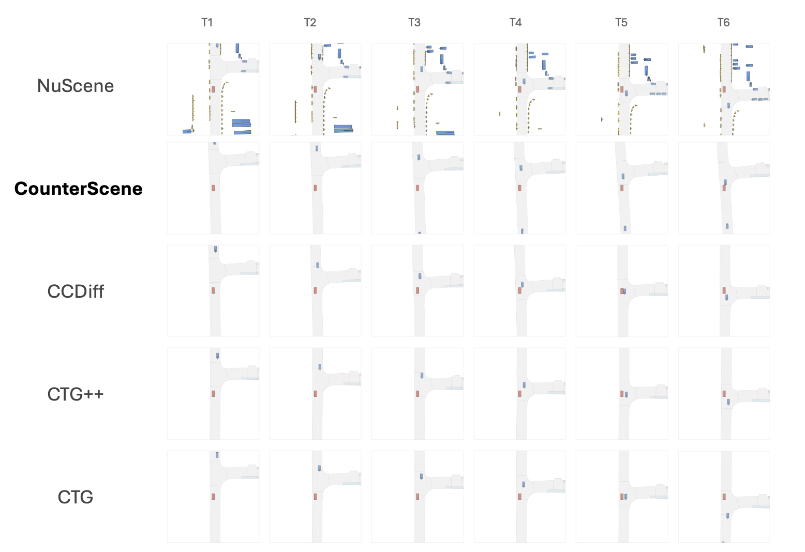
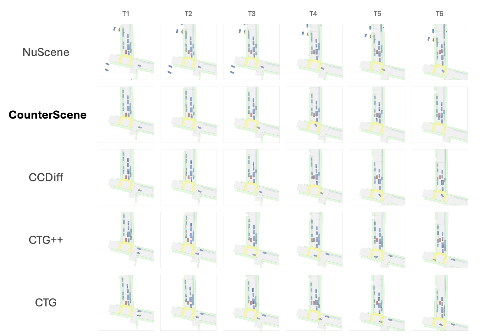

<div align="center">
<h2 align="center">
  <b>
    <span>━━━━━━━━━━━━━━━━━━━━━━━━━━━</span>
    <br/>
     CounterScene
    <br/>
    <span>━━━━━━━━━━━━━━━━━━━━━━━━━━━</span>
    <br/>
  </b>
</h2>
</div>

<p align="center">
  <b>Counterfactual Causal Reasoning in Generative World Models for Safety-Critical Closed-Loop Evaluation</b>
</p>

<p align="center">
  Bowen Jing, Ruiyang Hao, Weitao Zhou, Haibao Yu
</p>

<p align="center">
  <a href="CounterScene.pdf">Paper</a> &nbsp;|&nbsp;
  <a href="#overview">Overview</a> &nbsp;|&nbsp;
  <a href="#main-results">Main Results</a> &nbsp;|&nbsp;
  <a href="#supplementary-tables">Supplementary Tables</a> &nbsp;|&nbsp;
  <a href="#qualitative-results">Qualitative Results</a> &nbsp;|&nbsp;
  <a href="#citation">Citation</a>
</p>

<p align="center">
  
</p>
<p align="center"><em>
  Counterfactual causal reasoning for safety-critical generative BEV world model. Given an observed traffic scene where the adversarial agent waits and the ego vehicle passes safely, CounterScene asks: what if the adversarial agent did not wait? By intervening on the agent trajectory, it constructs a counterfactual world that induces safety-critical interactions while preserving realistic traffic dynamics.
</em></p>

---

This repository accompanies **CounterScene**, a framework that introduces structured counterfactual causal reasoning into diffusion-based BEV world models for safety-critical closed-loop traffic evaluation. The repository currently hosts the paper, key figures, and all table data reproduced from the paper and appendix.

CounterScene addresses a simple question: in a safe scene, **which single agent behavior is maintaining safety, and what minimal change would flip the outcome from safe to dangerous?** The method answers this with causal adversarial agent identification, a causal interaction graph, and stage-adaptive counterfactual guidance during diffusion sampling.

## Overview

Generating safety-critical driving scenarios requires understanding *why* dangerous interactions arise, not just forcing collisions. Existing methods typically use heuristic agent selection and generic perturbations, which creates a realism-versus-adversariality trade-off. CounterScene instead performs a minimal counterfactual intervention on the causally critical agent while letting the rest of the scene evolve under the world model's learned dynamics.

<p align="center">
  
</p>
<p align="center"><em>
  Overview of CounterScene. The framework consists of four modules: (1) causal adversarial agent selection, (2) a Causal Interaction Graph (CIG), (3) a diffusion-based interactive BEV world model with a SceneTransformer denoiser, and (4) counterfactual guidance that perturbs only the adversarial agent trajectory during denoising.
</em></p>

### Core Ideas

1. **Causal adversarial agent selection** identifies the single agent whose current behavior suppresses the most latent risk.
2. **Causal Interaction Graph (CIG)** models conflict-aware dependencies between agents so interventions propagate through realistic interaction pathways.
3. **Counterfactual guidance** removes spatial and temporal safety margins during diffusion, rather than prescribing an explicit collision trajectory.
4. **Closed-loop rollout** lets all non-target agents react naturally, preserving realistic multi-agent dynamics.

### Method Positioning

**Comparison of representative safety-critical generative simulation methods.** We compare key design dimensions, including adversarial agent selection, interaction modeling, and counterfactual intervention. Existing approaches typically rely on heuristic agent selection and lack explicit causal interaction modeling, which limits their ability to construct controllable high-risk interactions. In contrast, CounterScene combines causal adversarial agent selection, causal interaction graph modeling, and counterfactual diffusion guidance to generate realistic yet safety-critical closed-loop interactions.

| Method | Agent Selection | Interaction Modeling | Counterfactual Intervention |
|:--|:--|:--|:--|
| STRIVE | None | Motion prior | Trajectory optimization |
| CTG | None | Implicit | Rule-guided diffusion |
| CTG++ | None | Implicit | Language-guided diffusion |
| SafeSim | Distance-based | None | Adversarial diffusion guidance |
| CCDiff | Manual / TTC-based | Compositional causal modeling | Structured diffusion guidance |
| CounterScene (Ours) | Causal selection | Causal Interaction Graph (CIG) | Counterfactual guided diffusion |

## Main Results

The main paper evaluates realism with **ADE**, **FDE**, and **ORR**, and adversarial effectiveness with **HBR** and **CR**. For readability, the grouped horizon tables from the paper are split into one table per horizon block below. Numerical values are reproduced directly from the paper; LaTeX emphasis styling is omitted.

### Results Across Prediction Horizons on nuScenes

**Main results across prediction horizons.** Realism (ADE, FDE, ORR) and adversarial effectiveness (HBR, CR) are averaged over short (1-4s), mid (5-7s), and long (8-10s) horizons. The paper's central claim is that CounterScene is the only method that simultaneously achieves superior realism and the highest collision rate, with the adversarial advantage widening at longer horizons.

#### Short Horizon Average (1-4s)

| Method | ADE | FDE | ORR | HBR | CR |
|:--|--:|--:|--:|--:|--:|
| CTG | 0.526 | 1.182 | 0.2% | 1.7% | 0.0% |
| VAE | 0.638 | 1.458 | 0.4% | 0.4% | 1.3% |
| STRIVE | 0.502 | 1.171 | 0.3% | 0.1% | 1.3% |
| CTG++ | 0.548 | 1.259 | 0.2% | 1.3% | 0.8% |
| CCDiff | 0.380 | 0.908 | 0.4% | 1.5% | 1.3% |
| CounterScene | 0.288 | 0.703 | 0.5% | 1.6% | 3.3% |

#### Mid Horizon Average (5-7s)

| Method | ADE | FDE | ORR | HBR | CR |
|:--|--:|--:|--:|--:|--:|
| CTG | 1.553 | 3.768 | 0.3% | 1.5% | 2.3% |
| VAE | 1.887 | 4.550 | 0.6% | 0.2% | 7.7% |
| STRIVE | 1.565 | 4.018 | 0.5% | 0.1% | 7.7% |
| CTG++ | 1.730 | 4.416 | 0.3% | 1.2% | 2.3% |
| CCDiff | 1.128 | 2.914 | 1.3% | 1.5% | 8.7% |
| CounterScene | 0.982 | 2.639 | 1.3% | 2.0% | 14.7% |

#### Long Horizon Average (8-10s)

| Method | ADE | FDE | ORR | HBR | CR |
|:--|--:|--:|--:|--:|--:|
| CTG | 2.480 | 6.143 | 0.2% | 1.4% | 2.0% |
| VAE | 3.086 | 7.433 | 1.0% | 0.2% | 13.3% |
| STRIVE | 2.722 | 7.060 | 0.8% | 0.1% | 15.3% |
| CTG++ | 2.963 | 7.525 | 0.2% | 1.3% | 3.7% |
| CCDiff | 2.092 | 5.898 | 2.3% | 1.5% | 12.3% |
| CounterScene | 1.877 | 5.141 | 1.9% | 1.8% | 22.7% |

CounterScene achieves both superior realism and the strongest adversarial effectiveness. Across all horizons, it attains the lowest ADE and FDE while also reaching the highest collision rate. The paper highlights that the advantage widens over longer horizons: at 8-10s, CounterScene reaches 22.7% CR versus 12.3% for CCDiff while keeping lower ADE (1.877 vs. 2.092), which suggests that the generated interactions naturally evolve into dangerous situations over time rather than being forced immediately.

The baselines exhibit the realism-versus-adversariality trade-off that CounterScene avoids. Conservative methods such as CTG and CTG++ preserve low off-road rates but rarely generate collisions, while perturbation-heavy methods such as STRIVE and VAE can raise long-horizon CR only at the cost of significantly degraded realism.

### Adversarial Agent Selection Analysis

**Agent-selection comparison under identical backbone and guidance.** CounterScene's causal selection achieves the best realism and highest CR, while CCDiff's TTC-based selection underperforms even random sampling.

| Selection Strategy | ADE | FDE | ORR | HBR | CR |
|:--|--:|--:|--:|--:|--:|
| Random | 1.024 | 2.696 | 1.4% | 1.8% | 10.0% |
| CCDiff | 1.036 | 2.708 | 1.4% | 1.7% | 8.0% |
| SafeSim | 1.004 | 2.643 | 1.3% | 1.7% | 9.5% |
| Ours | 0.721 | 1.898 | 1.1% | 1.8% | 11.0% |

The paper's key observation is that selecting the wrong agent hurts realism more than it hurts raw adversarial effectiveness. ADE ranges from 0.721 to 1.036, while CR varies only from 8.0% to 11.0%. This indicates that when guidance is applied to a non-causal agent, the model must force increasingly unnatural behavior to produce any collision at all.

### Ablation Study

**Ablation study averaged across 3s and 7s.** Adaptive temporal compression has the largest CR impact; jerk regularization and progressive scheduling mainly preserve realism. The minimal variant degrades all metrics.

| # | Variant | ADE | FDE | ORR | HBR | CR |
|:--|:--|--:|--:|--:|--:|--:|
| 1 | Full | 0.747 | 1.978 | 0.9% | 1.8% | 11.0% |
| 2 | No Jerk | 0.784 | 2.098 | 1.0% | 1.6% | 10.5% |
| 3 | No Conflict Aware | 0.768 | 2.052 | 1.0% | 1.6% | 9.0% |
| 4 | No Progressive | 0.775 | 2.072 | 1.0% | 1.6% | 9.0% |
| 5 | No Adaptive | 0.753 | 2.000 | 0.9% | 1.7% | 7.5% |
| 6 | Minimal | 0.798 | 2.157 | 1.2% | 1.4% | 6.5% |

The paper attributes the largest collision-rate drop to removing adaptive arrival-time compression (11.0% to 7.5%), which supports the counterfactual interpretation that many safe interactions are maintained by a precise temporal margin. Jerk regularization and progressive scheduling mostly protect physical plausibility and geometric realism.

### Zero-Shot Cross-Dataset Transfer on nuPlan

**Zero-shot cross-dataset transfer on nuPlan.** All models are trained on nuScenes only and evaluated on nuPlan without retraining or tuning. The paper reports that CounterScene achieves the best realism across all horizons, generates strong near-miss interactions at short horizons, and matches the top collision rate at longer horizons while maintaining much better trajectory quality.

#### nuPlan at 3s

| Method | ADE | FDE | ORR | HBR | CR |
|:--|--:|--:|--:|--:|--:|
| CTG | 0.801 | 1.959 | 0.4% | 7.3% | 5.1% |
| STRIVE | 0.672 | 1.629 | 0.4% | 4.5% | 4.0% |
| CTG++ | 1.199 | 2.636 | 0.2% | 4.5% | 15.2% |
| CCDiff | 0.688 | 1.734 | 0.8% | 17.2% | 14.1% |
| CounterScene | 0.535 | 1.293 | 0.9% | 17.6% | 5.4% |

#### nuPlan at 5s

| Method | ADE | FDE | ORR | HBR | CR |
|:--|--:|--:|--:|--:|--:|
| CTG | 1.609 | 4.075 | 0.6% | 7.0% | 10.1% |
| STRIVE | 1.332 | 3.427 | 0.6% | 4.3% | 16.2% |
| CTG++ | 2.282 | 5.233 | 0.1% | 4.8% | 13.1% |
| CCDiff | 1.564 | 4.172 | 1.3% | 16.3% | 28.3% |
| CounterScene | 1.111 | 2.782 | 1.4% | 16.4% | 22.8% |

#### nuPlan at 7s

| Method | ADE | FDE | ORR | HBR | CR |
|:--|--:|--:|--:|--:|--:|
| CTG | 2.513 | 6.462 | 1.0% | 6.5% | 18.2% |
| STRIVE | 2.113 | 5.585 | 1.0% | 4.2% | 23.2% |
| CTG++ | 3.429 | 8.149 | 0.1% | 4.5% | 15.2% |
| CCDiff | 2.534 | 6.789 | 1.5% | 15.6% | 40.2% |
| CounterScene | 2.021 | 5.020 | 1.5% | 15.5% | 40.2% |

The nuPlan results reveal a distinct generation profile. At 3s, CounterScene has the highest HBR (17.6%) but only modest CR (5.4%), which the paper interprets as realistic near-miss interactions that are dangerous enough to trigger emergency braking but not yet long enough to culminate in physical overlap. As the horizon extends, those near-misses evolve into collisions while realism remains substantially better than the strongest baselines.

The paper further argues that this transferability comes from targeting invariant physical conflict variables - spatial convergence and temporal compression - rather than dataset-specific behavioral correlations.

## Qualitative Results

The qualitative figures below use the image assets in this repository together with the paper's figure descriptions.

### Scene 103

<p align="center">
  
</p>
<p align="center"><em>
  Qualitative comparison in a merging scenario (Scene 103, 10-second closed-loop rollout at 10 Hz). In the factual scene, the side-road vehicle yields and the ego passes safely. CounterScene identifies that yielding vehicle as the causal variable and progressively compresses its spatiotemporal margin, producing an aggressive cut-in that forces emergency hard braking. Baseline methods either preserve the safe yielding behavior or introduce unstructured distortions that do not create a structurally valid critical interaction.
</em></p>

### Scene 110

<p align="center">
  
</p>
<p align="center"><em>
  Qualitative comparison of a merging collision in Scene 110. In the factual scene, the merging vehicle from the side road actively maintains safety by yielding. CounterScene identifies that vehicle as the causal variable and strips its safety margin, generating a realistic collision as the adversarial agent merges without yielding. Baselines fail either by preserving the original yielding behavior or by adding unstructured noise that never leads to a plausible collision.
</em></p>

### Scene 905

<p align="center">
  
</p>
<p align="center"><em>
  Qualitative comparison of a rear-end collision in Scene 905. In the recorded safe scene, the trailing vehicle maintains a safe longitudinal and temporal margin. CounterScene identifies that trailing vehicle as the causal variable and compresses the margin, causing a realistic rear-end crash without distorting the rest of the scene. Baselines either keep the safe following distance or induce off-course behavior that does not result in a physically plausible impact.
</em></p>

### Scene 913

<p align="center">
  
</p>
<p align="center"><em>
  Qualitative comparison of a head-on collision induced by a subtle trajectory shift in Scene 913. In the factual scene, the other-path vehicle keeps its nominal route and preserves a safe spatial margin. CounterScene applies a minimal targeted spatial intervention that redirects it into the ego path, culminating in a severe head-on crash. Baselines miss this subtle vulnerability and either preserve the safe trajectory or produce unrealistic meandering.
</em></p>

### Scene 915

<p align="center">
  
</p>
<p align="center"><em>
  Qualitative comparison of a high-speed rear-end collision in Scene 915. In the factual scene, the trailing vehicle decelerates appropriately and maintains a safe margin. CounterScene suppresses that braking behavior, preserves high speed, and compresses the temporal gap to zero, yielding a severe but physically plausible rear-end crash. Baselines either keep the safe deceleration pattern or perturb the vehicle heading without achieving a precise longitudinal collision.
</em></p>

## Supplementary Tables

The appendix tables below are included in full. To keep the main page readable, the longer tables are folded into expandable sections.

<details>
<summary><b>Hyper-parameters and guidance configuration</b></summary>

<br/>

**Hyper-parameters used in CounterScene experiments.** The appendix describes CounterScene as two tightly coupled components: a graph-conditioned diffusion backbone for realistic multi-agent trajectory generation, and an inference-time conflict-aware guidance module for constructing safety-critical interactions during closed-loop rollout.

### Backbone and Training

| Parameter | Value | Parameter | Value |
|:--|:--|:--|:--|
| Step length | 0.1 s | Map encoder | ResNet-18 |
| History steps | 31 | Map feature dim. | 128 |
| Prediction horizon | 52 | History feature dim. | 64 |
| Future horizon | 5.2 s | Attention heads | 16 |
| Learning rate | 1e-4 | Temporal decoder layers | 2 |
| Optimizer | Adam | Social decoder layers / block | 4 |
| Configured batch size | 4 | Diffusion steps | 100 |
| Training steps | 100,000 | Validation samples | 10 |
| GPUs | 3 | Motion distance metric | TTC + intersection |
| EMA step | 1 | Social attention threshold | 0.8 |
| EMA decay | 0.995 | Neighbor distance cap | 50 m |
| EMA warm-up start | 4,000 | Conditioning drop (graph) | 0.1 |

### Inference-Time Guidance

| Parameter | Value | Parameter | Value |
|:--|:--|:--|:--|
| Perturbation optimizer | Adam | Guidance gradient steps | 30 |
| Perturbation learning rate | 0.001 | Perturbation constraint norm | 100 |
| Final-step guidance optimizer | Adam | Final-step guidance learning rate | 0.3 |
| Final-step guidance steps | 1 | Intermediate guidance | Enabled |
| Output-stage guidance | Disabled | Action horizon per update | 5 |
| Collision guidance weight | -50.0 | Map guidance weight | 1.0 |

**Progressive guidance configuration in CounterScene.** The appendix explains that guidance is weak early, ramps up in the middle, and is strongest late in denoising, while arrival-time compression activates only after the midpoint.

| Setting | Early | Mid | Late |
|:--|:--|:--|:--|
| Normalized progress p | [0, 0.3) | [0.3, 0.7) | [0.7, 1.0] |
| Stage multiplier m(p) | 0.2 | linear 0.2 -> 1.5 | linear 1.5 -> 3.0 |
| Primary objective | coarse spatial attraction | stronger attraction and timing alignment | precise collision shaping |
| Arrival-time compression | off | active only for p >= 0.5 | on |
| Jerk regularization | on if enabled | on if enabled | on if enabled |
| Conflict-aware base weights | fixed by type | fixed by type | fixed by type |
| Map-collision weight | 2.0 | 2.0 | 2.0 |
| Target geometry | point target | point target | point target |

</details>

<details>
<summary><b>Full per-horizon results on nuScenes (1s-10s)</b></summary>

<br/>

**Full per-horizon results on nuScenes (10 Hz).** The main paper reports grouped short-, mid-, and long-horizon averages; the appendix provides the complete per-second breakdown from 1s to 10s. ORR, HBR, and CR are percentages.

| Horizon | Metric | CTG | VAE | STRIVE | CTG++ | CCDiff | CounterScene |
|:--|:--|--:|--:|--:|--:|--:|--:|
| 1s | ADE | 0.178 | 0.206 | 0.170 | 0.185 | 0.125 | 0.089 |
| 1s | FDE | 0.348 | 0.415 | 0.326 | 0.361 | 0.247 | 0.174 |
| 1s | ORR | 0.2% | 0.3% | 0.2% | 0.2% | 0.2% | 0.2% |
| 1s | HBR | 1.9% | 0.5% | 0.2% | 1.5% | 1.4% | 1.3% |
| 1s | CR | 0.0% | 0.0% | 0.0% | 0.0% | 0.0% | 0.0% |
| 2s | ADE | 0.393 | 0.467 | 0.359 | 0.409 | 0.263 | 0.184 |
| 2s | FDE | 0.854 | 1.037 | 0.783 | 0.902 | 0.589 | 0.410 |
| 2s | ORR | 0.2% | 0.4% | 0.3% | 0.2% | 0.3% | 0.3% |
| 2s | HBR | 1.7% | 0.4% | 0.0% | 1.3% | 1.5% | 1.6% |
| 2s | CR | 0.0% | 0.0% | 0.0% | 0.0% | 1.0% | 3.0% |
| 3s | ADE | 0.634 | 0.770 | 0.600 | 0.692 | 0.437 | 0.338 |
| 3s | FDE | 1.425 | 1.773 | 1.410 | 1.589 | 1.033 | 0.814 |
| 3s | ORR | 0.2% | 0.4% | 0.4% | 0.2% | 0.5% | 0.5% |
| 3s | HBR | 1.5% | 0.3% | 0.1% | 1.0% | 1.5% | 1.7% |
| 3s | CR | 0.0% | 0.0% | 1.0% | 0.0% | 2.0% | 4.0% |
| 4s | ADE | 0.900 | 1.107 | 0.880 | 0.906 | 0.695 | 0.542 |
| 4s | FDE | 2.102 | 2.605 | 2.166 | 2.183 | 1.764 | 1.414 |
| 4s | ORR | 0.2% | 0.4% | 0.4% | 0.2% | 0.6% | 0.8% |
| 4s | HBR | 1.5% | 0.2% | 0.1% | 1.2% | 1.4% | 1.9% |
| 4s | CR | 0.0% | 5.0% | 4.0% | 3.0% | 2.0% | 6.0% |
| 5s | ADE | 1.245 | 1.497 | 1.215 | 1.273 | 0.924 | 0.731 |
| 5s | FDE | 2.977 | 3.597 | 3.078 | 3.190 | 2.421 | 1.967 |
| 5s | ORR | 0.3% | 0.5% | 0.5% | 0.2% | 1.2% | 1.1% |
| 5s | HBR | 1.6% | 0.2% | 0.1% | 1.1% | 1.5% | 2.0% |
| 5s | CR | 1.0% | 6.0% | 6.0% | 1.0% | 3.0% | 11.0% |
| 6s | ADE | 1.503 | 1.873 | 1.558 | 1.767 | 1.205 | 1.059 |
| 6s | FDE | 3.620 | 4.528 | 4.001 | 4.438 | 3.179 | 2.810 |
| 6s | ORR | 0.2% | 0.6% | 0.5% | 0.3% | 1.4% | 1.5% |
| 6s | HBR | 1.5% | 0.2% | 0.1% | 1.3% | 1.7% | 2.0% |
| 6s | CR | 2.0% | 7.0% | 7.0% | 3.0% | 5.0% | 15.0% |
| 7s | ADE | 1.910 | 2.291 | 1.921 | 2.149 | 1.255 | 1.155 |
| 7s | FDE | 4.708 | 5.525 | 4.974 | 5.620 | 3.141 | 3.141 |
| 7s | ORR | 0.3% | 0.7% | 0.6% | 0.3% | 1.4% | 1.4% |
| 7s | HBR | 1.4% | 0.2% | 0.1% | 1.2% | 1.3% | 1.9% |
| 7s | CR | 4.0% | 10.0% | 10.0% | 3.0% | 18.0% | 18.0% |
| 8s | ADE | 2.149 | 2.667 | 2.303 | 2.632 | 1.726 | 1.551 |
| 8s | FDE | 5.274 | 6.413 | 5.973 | 6.699 | 4.606 | 4.184 |
| 8s | ORR | 0.2% | 0.8% | 0.7% | 0.3% | 1.8% | 1.5% |
| 8s | HBR | 1.4% | 0.2% | 0.0% | 1.3% | 1.4% | 1.9% |
| 8s | CR | 0.0% | 11.0% | 14.0% | 2.0% | 9.0% | 18.0% |
| 9s | ADE | 2.571 | 3.082 | 2.737 | 2.925 | 2.184 | 1.812 |
| 9s | FDE | 6.363 | 7.380 | 7.087 | 7.483 | 5.835 | 5.087 |
| 9s | ORR | 0.2% | 0.9% | 0.8% | 0.2% | 2.4% | 1.9% |
| 9s | HBR | 1.5% | 0.2% | 0.1% | 1.2% | 1.6% | 1.8% |
| 9s | CR | 3.0% | 14.0% | 15.0% | 5.0% | 12.0% | 24.0% |
| 10s | ADE | 2.720 | 3.509 | 3.126 | 3.333 | 2.367 | 2.267 |
| 10s | FDE | 6.792 | 8.505 | 8.119 | 8.392 | 7.253 | 6.153 |
| 10s | ORR | 0.2% | 1.2% | 0.9% | 0.2% | 2.6% | 2.3% |
| 10s | HBR | 1.4% | 0.2% | 0.1% | 1.4% | 1.4% | 1.7% |
| 10s | CR | 3.0% | 15.0% | 17.0% | 4.0% | 16.0% | 26.0% |

</details>

<details>
<summary><b>Extended ablation analysis</b></summary>

<br/>

**Ablation results on nuScenes at 3s, 7s, and 10s.** PG: progressive guidance, CW: conflict-aware weighting, ATC: adaptive arrival-time compression, JR: jerk regularization. The appendix reports that the full model gives the best overall balance, removing ATC causes the largest CR drop, and JR mainly affects smoothness and realism rather than collision formation.

| Horizon | Setting | PG | CW | ATC | JR | ADE | FDE | ORR | CR | HBR |
|:--|:--|:--:|:--:|:--:|:--:|--:|--:|--:|--:|--:|
| 3s | Full (Ours) | yes | yes | yes | yes | 0.338 | 0.814 | 0.5% | 4.0% | 1.7% |
| 3s | No Jerk | yes | yes | yes | no | 0.362 | 0.875 | 0.6% | 4.0% | 1.5% |
| 3s | No Conflict Aware | yes | no | yes | yes | 0.350 | 0.845 | 0.6% | 3.0% | 1.5% |
| 3s | No Progressive | no | yes | yes | yes | 0.355 | 0.855 | 0.6% | 3.0% | 1.5% |
| 3s | No Adaptive | yes | yes | no | yes | 0.340 | 0.820 | 0.5% | 2.0% | 1.6% |
| 3s | Minimal | no | no | no | no | 0.372 | 0.895 | 0.7% | 2.0% | 1.3% |
| 7s | Full (Ours) | yes | yes | yes | yes | 1.155 | 3.141 | 1.4% | 18.0% | 1.9% |
| 7s | No Jerk | yes | yes | yes | no | 1.205 | 3.320 | 1.5% | 17.0% | 1.7% |
| 7s | No Conflict Aware | yes | no | yes | yes | 1.185 | 3.260 | 1.5% | 15.0% | 1.7% |
| 7s | No Progressive | no | yes | yes | yes | 1.195 | 3.290 | 1.5% | 15.0% | 1.7% |
| 7s | No Adaptive | yes | yes | no | yes | 1.165 | 3.180 | 1.4% | 13.0% | 1.8% |
| 7s | Minimal | no | no | no | no | 1.225 | 3.420 | 1.7% | 11.0% | 1.5% |
| 10s | Full (Ours) | yes | yes | yes | yes | 2.320 | 6.380 | 2.2% | 32.0% | 2.1% |
| 10s | No Jerk | yes | yes | yes | no | 2.380 | 6.560 | 2.3% | 30.0% | 1.9% |
| 10s | No Conflict Aware | yes | no | yes | yes | 2.350 | 6.500 | 2.3% | 27.0% | 1.9% |
| 10s | No Progressive | no | yes | yes | yes | 2.360 | 6.520 | 2.3% | 27.0% | 1.9% |
| 10s | No Adaptive | yes | yes | no | yes | 2.330 | 6.420 | 2.2% | 24.0% | 2.0% |
| 10s | Minimal | no | no | no | no | 2.420 | 6.700 | 2.5% | 20.0% | 1.8% |

</details>

<details>
<summary><b>Guidance strength sensitivity</b></summary>

<br/>

**Guidance strength sensitivity across scheduling variants on nuScenes.** The appendix varies early, mid, and late-stage multipliers and finds that the balanced schedule provides the most stable overall trade-off, while aggressive late guidance slightly harms realism and constant guidance performs worse than progressive schedules.

| Horizon | Experiment | ADE | FDE |
|:--|:--|--:|--:|
| 3s | balanced | 0.338 | 0.814 |
| 3s | conservative | 0.338 | 0.814 |
| 3s | constant | 0.339 | 0.821 |
| 3s | very_aggressive | 0.340 | 0.823 |
| 3s | very_conservative | 0.338 | 0.813 |
| 7s | balanced | 1.155 | 3.141 |
| 7s | conservative | 1.155 | 3.143 |
| 7s | constant | 1.160 | 3.158 |
| 7s | very_aggressive | 1.160 | 3.153 |
| 7s | very_conservative | 1.157 | 3.145 |
| 10s | balanced | 2.267 | 6.153 |
| 10s | conservative | 2.268 | 6.161 |
| 10s | constant | 2.291 | 6.218 |
| 10s | very_aggressive | 2.304 | 6.256 |
| 10s | very_conservative | 2.263 | 6.133 |

</details>

## Citation

If you found this work useful, please cite:

```bib
@misc{jing2026counterscene,
  title  = {CounterScene: Counterfactual Causal Reasoning in Generative World Models for Safety-Critical Closed-Loop Evaluation},
  author = {Jing, Bowen and Hao, Ruiyang and Zhou, Weitao and Yu, Haibao},
  year   = {2026}
}
```
